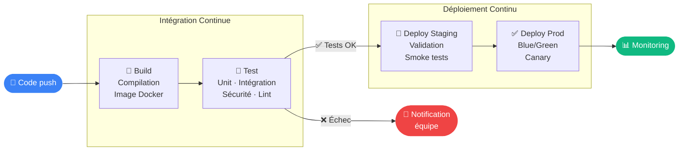

# Pipeline

---

## Définition

Un pipeline CI/CD est une séquence automatisée d'étapes (stages) qui transforme du code source en un artefact déployé en production. Chaque stage doit réussir avant que le suivant ne commence.

---

## Pourquoi c'est important

> [!tip] L'automatisation comme filet de sécurité
> Un pipeline bien conçu est un garde-fou : il est impossible de déployer du code qui ne compile pas, ne passe pas les tests, ou ne respecte pas les standards de qualité. Il remplace les procédures manuelles oubliables par des étapes répétables.

---

## Flux d'un pipeline



## Structure d'un pipeline

```yaml
# GitHub Actions — exemple complet
name: CI/CD Pipeline

on: [push, pull_request]

jobs:
  build:
    runs-on: ubuntu-latest
    steps:
      - uses: actions/checkout@v4
      - name: Build Docker image
        run: docker build -t myapp:${{ github.sha }} .

  test:
    needs: build
    runs-on: ubuntu-latest
    steps:
      - name: Run tests
        run: docker run myapp:${{ github.sha }} npm test

  deploy:
    needs: test
    if: github.ref == 'refs/heads/main'
    runs-on: ubuntu-latest
    steps:
      - name: Deploy to production
        run: ./deploy.sh
```

---

## Principes d'un bon pipeline

| Principe | Description |
|---|---|
| Fail fast | Les étapes rapides en premier (lint avant tests e2e) |
| Idempotent | Re-exécutable sans effets de bord |
| Reproductible | Même résultat avec le même code |
| Rapide | < 10 min pour feedback développeur |

---

> [!note]
> Voir [[Build stage]], [[Test stage]], [[Deploy stage]] pour le détail de chaque étape.
