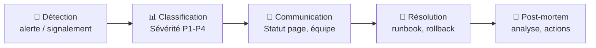

# Incident response (Réponse aux incidents)

## Définition

L'incident response (IR) est le processus structuré de détection, classification, confinement, résolution et analyse post-mortem d'un incident informatique. Un bon processus IR réduit le MTTR (Mean Time To Recovery).

> [!tip] La priorité en incident : restaurer le service
> En cas d'incident, la priorité absolue est de restaurer le service (même avec un fix temporaire), pas de trouver la cause racine. L'analyse post-mortem vient après.

## Les phases de l'incident response



## Niveaux de sévérité

| Niveau | Impact | Exemple | Réponse |
|--------|--------|---------|---------|
| P1 | Service totalement indisponible | Prod down | Immédiat, 24/7 |
| P2 | Fonctionnalité majeure dégradée | Paiements lents | < 30min |
| P3 | Fonctionnalité mineure impactée | Dashboard lent | < 4h |
| P4 | Impact minimal, workaround dispo | Bug UI | Prochaine sprint |

## Communication durant l'incident

```markdown
# Template de mise à jour statut (toutes les 30min)

**[14:35 UTC] — Mise à jour #2**
**Statut :** En cours d'investigation
**Impact :** Paiements indisponibles (~500 utilisateurs affectés)
**Actions en cours :** Rollback vers la version 2.3.1 en cours
**Prochaine mise à jour :** Dans 30 minutes ou en cas d'évolution

—— Équipe SRE
```

## Post-mortem blameless

```markdown
# Post-mortem — [Titre de l'incident]
**Date :** [date] **Durée :** [hh:mm]
**Sévérité :** P1 **Participants :** [liste]

## Résumé
[2-3 phrases décrivant ce qui s'est passé]

## Timeline
- 14:00 — Première alerte Prometheus
- 14:05 — Ingénieur d'astreinte paginé
- 14:20 — Cause racine identifiée
- 14:45 — Service restauré

## Cause racine
[Description technique précise]

## Actions correctives
- [ ] [Action 1] — responsable: X — deadline: 2024-02-01
- [ ] [Action 2] — responsable: Y — deadline: 2024-02-15
```

## Liens

- [[Disaster Recovery]]
- [[Runbooks]]
- [[Game days]]
- [[Monitoring]]
