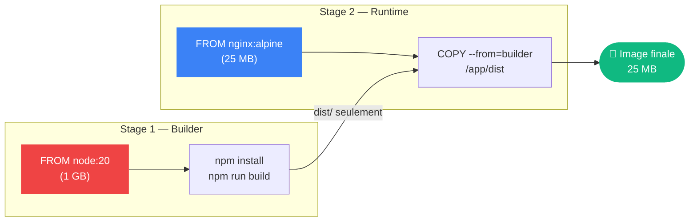

# Multi stage builds

---

## Définition

Les multi-stage builds permettent d'utiliser plusieurs [[Instructions]] `FROM` dans un seul [[Dockerfile]]. Chaque étape peut partir d'une image différente et copier sélectivement des artefacts des étapes précédentes. Résultat : une image finale **légère** contenant uniquement le nécessaire pour le runtime.

---

## Pourquoi c'est important

> [!tip] Séparer build et runtime
> L'étape de build peut avoir des compilateurs, outils de test, dépendances de dev — l'image finale n'embarque que le binaire/artefact. L'image peut passer de 1GB à 50MB.

---

## Principe



## Exemple Node.js

```dockerfile
# Étape 1 : Build
FROM node:20-alpine AS builder
WORKDIR /app
COPY package*.json ./
RUN npm ci
COPY . .
RUN npm run build

# Étape 2 : Production (léger)
FROM nginx:alpine AS production
COPY --from=builder /app/dist /usr/share/nginx/html
EXPOSE 80
CMD ["nginx", "-g", "daemon off;"]
```

---

## Exemple Go (binaire statique)

```dockerfile
FROM golang:1.22-alpine AS builder
WORKDIR /app
COPY go.mod go.sum ./
RUN go mod download
COPY . .
RUN CGO_ENABLED=0 go build -o api ./cmd/api

FROM scratch AS production
COPY --from=builder /app/api /api
EXPOSE 8080
ENTRYPOINT ["/api"]
```

---

## Build d'une étape spécifique

```bash
# Builder seulement l'étape "builder" (pour debug)
docker build --target builder -t mon-app:debug .
```

| Stack | Image build | Image runtime | Réduction |
|---|---|---|---|
| [[Node]].js | node:20 (1GB) | [[Nginx]]:alpine (25MB) | 97% |
| Go | golang:1.22 (600MB) | scratch (0MB) | 100% |
| Python | python:3.12 (1GB) | python:3.12-slim (130MB) | 87% |
