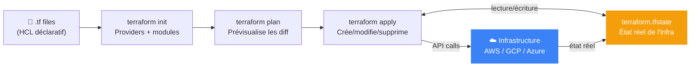

# Terraform

---

## Définition

Terraform est l'outil d'[[Infrastructure as Code]] le plus répandu. Il permet de définir l'infrastructure (VMs, réseaux, bases de données) dans des fichiers HCL déclaratifs, et de la provisionner/modifier via des commandes CLI.

---

## Pourquoi c'est important

> [!tip] L'infrastructure comme du code
> Terraform permet de versionner l'infrastructure dans [[Git]], de revoir les changements via PR, et de reproduire des environnements identiques. "Si ce n'est pas dans Terraform, ça n'existe pas."

---

## Fichiers clés

```
project/
├── main.tf          # ressources principales
├── variables.tf     # déclaration des variables
├── outputs.tf       # valeurs exportées
├── providers.tf     # configuration des providers
├── versions.tf      # contraintes de versions
└── terraform.tfvars # valeurs des variables (gitignore!)
```

---

## Workflow de base



```bash
terraform init      # initialiser, télécharger providers
terraform plan      # prévisualiser les changements
terraform apply     # appliquer les changements
terraform destroy   # détruire l'infrastructure
```

---

## Ressource simple

```hcl
resource "aws_instance" "web" {
  ami           = "ami-0c55b159cbfafe1f0"
  instance_type = "t3.medium"

  tags = {
    Name        = "web-server"
    Environment = var.environment
  }
}
```
