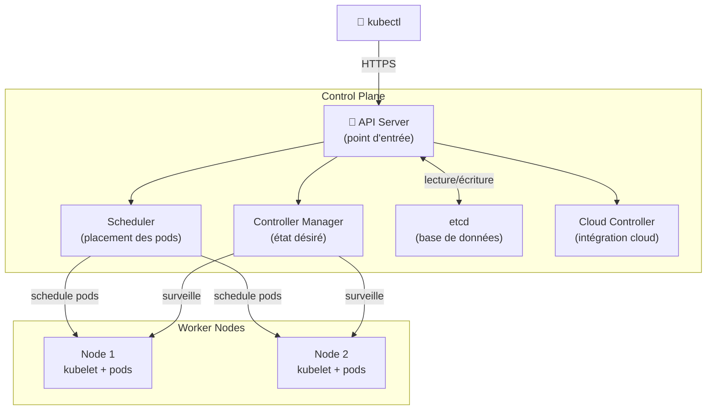

# Control plane

---

## Définition

Le **Control Plane** est la partie du [[Cluster]] [[Kubernetes]] qui **contrôle et orchestre l’ensemble du système**.

Il agit comme le **cerveau du cluster**.

Son rôle est de :

- gérer l’état du cluster
- planifier les workloads
- maintenir l’état désiré
- coordonner les [[Node]]

Le Control Plane ne fait **pas tourner les applications**.  
Ce sont les **Nodes** qui exécutent les **[[Pods]]**.

---

## Architecture du Control Plane

Le Control Plane est composé de plusieurs composants :



---

## API Server

Le **[[API server]]** est le **point d’entrée du cluster Kubernetes**.

Tous les composants communiquent avec Kubernetes via l’API.

Il permet :

- de recevoir les commandes ([[kubectl]])
- de valider les requêtes
- de mettre à jour l’état du cluster

Exemple :
```bash
kubectl get pods
```

Cette commande parle au **API Server**.

---

## Scheduler

Le **[[Scheduler]]** décide **sur quel node un pod doit être exécuté**.

Il analyse :

- les ressources disponibles
- les contraintes
- les labels
- les taints

Puis il assigne le pod au node le plus approprié.

---

## Controller Manager

Le **[[Controller manager]]** maintient l’état désiré du cluster.

Il exécute plusieurs contrôleurs :

- Node Controller
- ReplicaSet Controller
- Deployment Controller
- Namespace Controller

Exemple :

Si un pod tombe :
```bash
desired state : 3 pods  
current state : 2 pods
```

Le controller recrée automatiquement un pod.

---

## Cloud Controller Manager

Le **[[Cloud controller manager]]** permet à Kubernetes d’interagir avec le **[[Cloud]] provider**.

Il gère par exemple :

- les [[Load balancers]]
- les nodes cloud
- les routes réseau
- les [[Volumes]] cloud

Utilisé avec :

- [[AWS]]
- GCP
- [[Azure]]

---

## etcd

**[[etcd]]** est la **base de données du cluster Kubernetes**.

Il stocke :

- la configuration du cluster
- l’état des ressources
- les informations sur les pods
- les [[Secrets]]
- les [[Services]]

etcd est une **base clé-valeur distribuée**.

Si etcd est perdu, le cluster ne peut plus fonctionner correctement.

---

## Pourquoi c'est important

Le Control Plane permet :

- la gestion centralisée du cluster
- l’orchestration automatique
- la résilience
- l’automatisation

Sans Control Plane :

- aucun pod ne peut être planifié
- aucune ressource ne peut être créée
- le cluster ne peut pas fonctionner.

---

## Exemple

Déploiement d'une application :
```bash
kubectl apply -f deployment.yaml
```

Processus :

```bash
Utilisateur  
 │  
 ▼  
API Server  
 │  
 ▼  
Scheduler choisit un node  
 │  
 ▼  
Controller Manager vérifie l'état  
 │  
 ▼  
Node lance le pod
```

