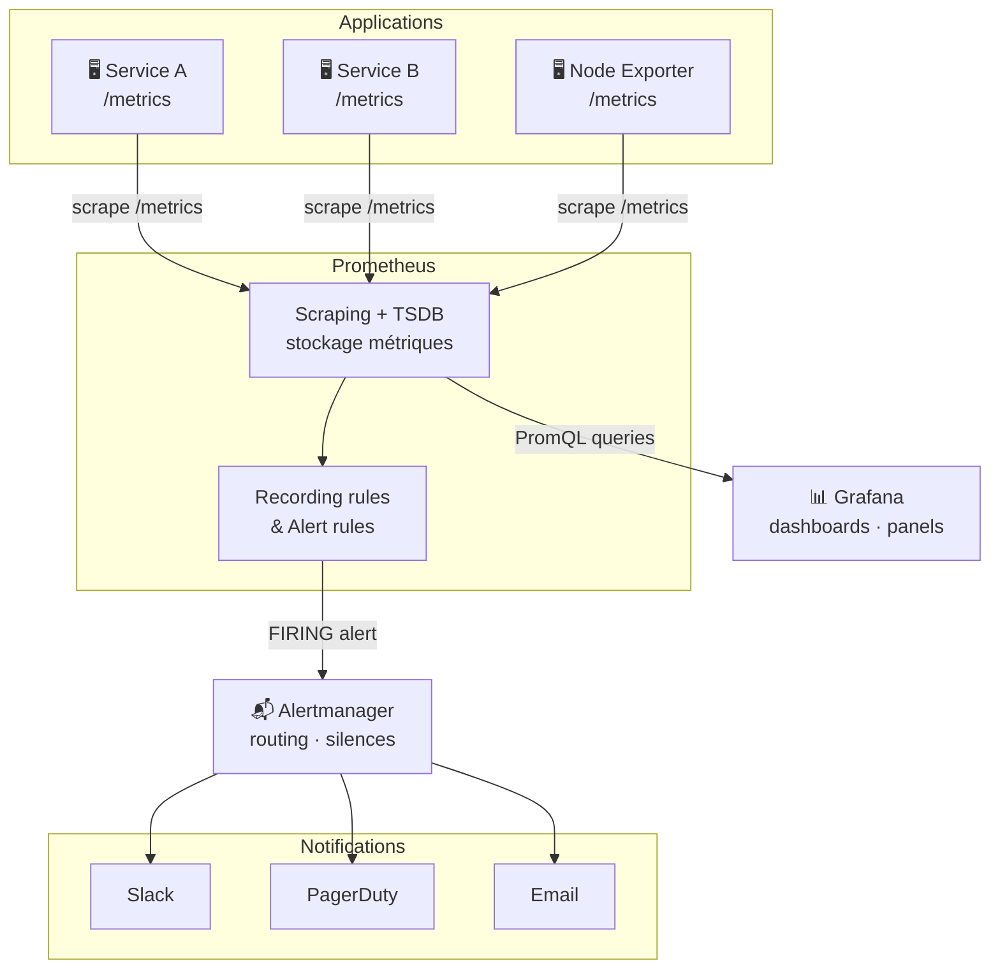

# Monitoring

---

## Définition

Le monitoring est la collecte, le stockage, et l'analyse de métriques pour surveiller l'état d'un système. Il permet de détecter les anomalies, de déclencher des alertes, et de diagnostiquer les problèmes.

---

## Stack de monitoring standard

---

## Pourquoi c'est important

> [!tip] Monitorer pour anticiper, pas pour réagir
> Le monitoring permet de détecter un problème avant que les utilisateurs ne le signalent. Une alerte sur "mémoire > 80%" donne le temps d'agir avant OOM. Une alerte sur "latence p99 > 2s" détecte une dégradation avant qu'elle ne devienne une panne.

---

## Les 4 signaux d'or (Google SRE)

| Signal | Description |
|---|---|
| Latency | Temps de réponse des requêtes |
| Traffic | Volume de requêtes/s |
| Errors | Taux d'erreur |
| Saturation | À quel point le service est "plein" |

---

> [!note]
> Voir [[Prometheus]] pour la collecte de métriques, [[Alertmanager]] pour le [[Routing]] des alertes, [[Grafana]] pour la visualisation.
