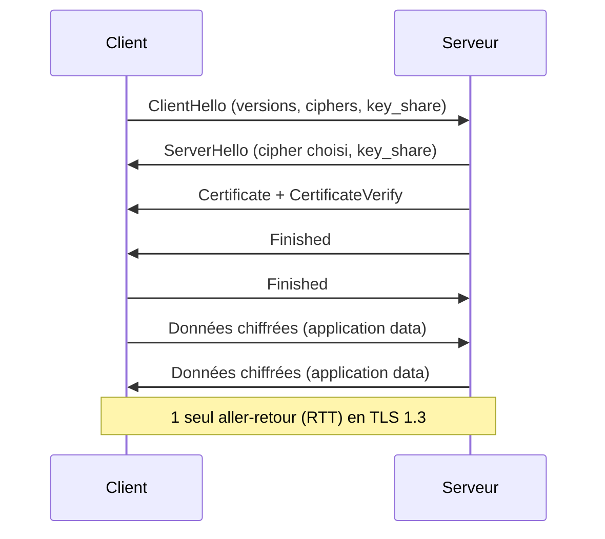

# TLS Handshake

## Définition

Le handshake TLS est la négociation initiale entre client et serveur pour établir une session chiffrée. Il authentifie le serveur et échange les clés de chiffrement.

> [!note] TLS 1.3 vs 1.2
> TLS 1.3 réduit le handshake à 1 aller-retour (vs 2 en TLS 1.2) et supprime les algorithmes obsolètes. Il est significativement plus rapide et sécurisé.

## Étapes TLS 1.3



## Déboguer un handshake

```bash
# Voir le handshake complet
openssl s_client -connect example.com:443 -msg

# Forcer TLS 1.3
openssl s_client -connect example.com:443 -tls1_3

# Voir les ciphers négociés
openssl s_client -connect example.com:443   | grep "Cipher is"
```

## Liens

- [[TLS]]
- [[Certificates]]
- [[Cipher suites]]
