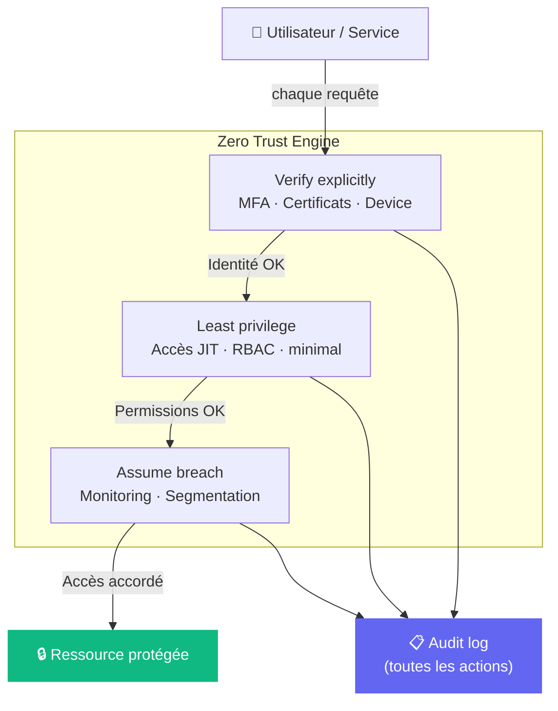

# Zero trust

## Définition

Le modèle Zero Trust repose sur le principe "Ne jamais faire confiance, toujours vérifier". Contrairement au modèle périmétrique, il n'y a pas de zone de confiance interne : chaque accès doit être authentifié, autorisé et chiffré.

> [!tip] Pourquoi c'est important
> Les réseaux d'entreprise sont poreux ([[VPN]] compromis, insider threats, [[Cloud]] multi-tenant). Zero Trust protège même si le périmètre est franchi.

## Piliers du Zero Trust



```
1. Verify explicitly    → Authentifier TOUJOURS (MFA, certificats)
2. Least privilege      → Accès minimal, juste-à-temps (JIT)
3. Assume breach        → Concevoir pour la compromission interne
```

## Zero Trust dans Kubernetes (service mesh)

```yaml
# Istio : mTLS entre tous les services (zero trust réseau)
apiVersion: security.istio.io/v1beta1
kind: PeerAuthentication
metadata:
  name: default
  namespace: default
spec:
  mtls:
    mode: STRICT  # mTLS obligatoire entre tous les pods
```

## Liens

- [[Assume breach]]
- [[Least privilege access]]
- [[Verify explicitly]]
- [[Mutual TLS]]
- [[RBAC]]
