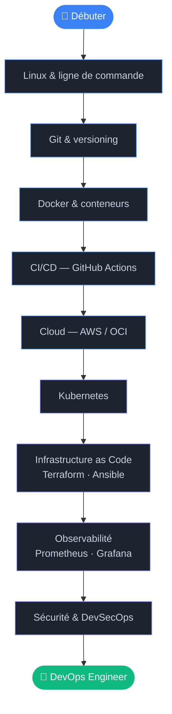

# Roadmap DevOps

Un parcours progressif pour comprendre et maîtriser le DevOps — du débutant au professionnel.

---

---

## Niveau 1 — Fondamentaux

> [!info] Linux & Ligne de commande
> La base de tout ingénieur DevOps. Système de fichiers, permissions, processus, scripting Bash.
> → [[Linux]]

> [!info] Git & Versioning
> Gestion de code source, branches, merge, workflows collaboratifs.
> → [[Git]]

> [!info] Docker & Conteneurs
> Comprendre les conteneurs, écrire des Dockerfiles, gérer des images et des volumes.
> → [[Docker]]

---

## Niveau 2 — Automatisation & Cloud

> [!tip] CI/CD
> Automatiser les tests, builds et déploiements avec des pipelines.
> → [[CI-CD]] · [[CI-CD/GitHub actions|GitHub Actions]] · [[CI-CD/GitLab CI|GitLab CI]] · [[CI-CD/Jenkins|Jenkins]]

> [!tip] Cloud
> Déployer et gérer des ressources sur les grands providers cloud.
> → [[Cloud]] · [[Cloud/AWS|AWS]] · [[Cloud/Azure|Azure]] · [[Cloud/Google Cloud|GCP]]

---

## Niveau 3 — Orchestration & Infrastructure

> [!example] Kubernetes
> Orchestrer des conteneurs à grande échelle, gérer des clusters, des workloads et des réseaux.
> → [[Kubernetes]]

> [!example] Infrastructure as Code
> Provisionner et configurer l'infrastructure de manière déclarative et reproductible.
> → [[Infrastructure as Code]]

---

## Niveau 4 — Production & Fiabilité

> [!abstract] Observabilité
> Monitorer, alerter, tracer — savoir ce qui se passe en production.
> → [[Observability]]

> [!warning] Sécurité & DevSecOps
> Intégrer la sécurité dans les pipelines, gérer les secrets, hardener les systèmes.
> → [[Security]]

---

> [!note] Par où commencer ?
> Si tu débutes, commence par **Linux** → **Git** → **Docker**. Ces trois blocs sont la fondation de tout le reste.
> Si tu as déjà de l'expérience, utilise la sidebar pour naviguer directement vers le domaine qui t'intéresse.
